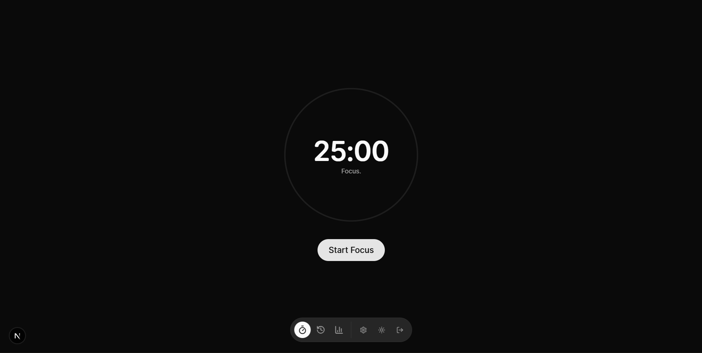
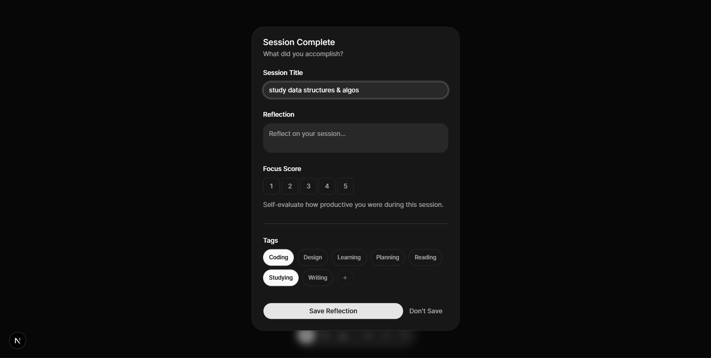
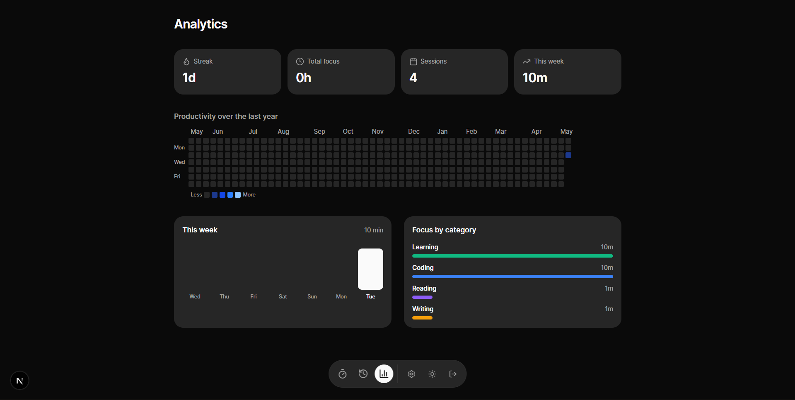

# timp

timp is a calm focus timer and reflection journal that visually tracks meaningful work over time.

## Core Features

- Pomodoro-style timer with customizable intervals
- Session reflections and journaling
- Contribution heatmap showing focus consistency
- Weekly and monthly analytics
- Tag-based session categorization

## Screenshots

## Credits

### Acknowledgements

timp was created because I wanted something like [Pomofocus](https://pomofocus.io/) by [Yuya Uzu](https://uzu.works/) but with UI like... the way  design I guess

### Connect

[Portfolio](https://yiliya.studio/) · [@yiliya_iya](https://x.com/yiliya_iya) on X

## License

[MIT](LICENSE)
